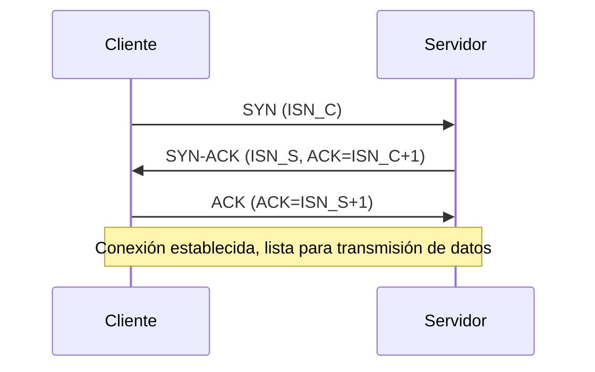

# **TCP** y **UDP**

En redes de computadoras, **TCP (Transmission Control Protocol)** y **UDP (User Datagram Protocol)** son dos protocolos de la capa de transporte del modelo TCP/IP. Aunque ambos permiten la comunicación entre procesos en diferentes dispositivos, su funcionamiento, fiabilidad y casos de uso son muy diferentes.

## **TCP (Transmission Control Protocol)**

### Características Principales
- **Orientado a conexión**: requiere un "handshake" antes de transmitir datos.
- **Fiable**: garantiza que los datos lleguen en orden, sin pérdidas ni duplicados.
- **Control de flujo y congestión**: ajusta la velocidad de transmisión según la capacidad del receptor y de la red.
- **Segmentación y reensamblaje**: divide datos grandes en segmentos y los reordena en destino.

---

### Proceso de Conexión (Three-Way Handshake)

1. **SYN**:  
   - El cliente envía un paquete con la bandera `SYN` (synchronize) para solicitar conexión.
   - Contiene un número de secuencia inicial (`ISN`).

2. **SYN-ACK**:  
   - El servidor responde con `SYN-ACK`.  
   - Incluye su propio número de secuencia inicial y confirma la recepción del SYN del cliente.

3. **ACK**:  
   - El cliente envía un `ACK` final confirmando la recepción.  
   - A partir de aquí, la conexión está establecida y se pueden enviar datos.

---

### TCP con TLS (Seguridad en la Conexión)

Una vez establecida la conexión TCP, puede ejecutarse **TLS (Transport Layer Security)** encima para cifrar y autenticar la comunicación. El flujo típico es:

- **Handshake TLS**:
  - Negociación de versión de TLS.
  - Selección de algoritmos criptográficos.
  - Intercambio de certificados digitales (el servidor demuestra su identidad).
  - Generación y compartición de claves de sesión (para cifrado simétrico eficiente).
- **Canal Seguro**:
  - Todo el tráfico posterior (HTTP, correos, etc.) viaja cifrado y con integridad garantizada.

---

### Diagrama de Three-Way Handshake en TCP

---

## **UDP (User Datagram Protocol)**

### Características Principales
- **No orientado a conexión**: no requiere handshake previo.
- **No fiable**: no garantiza entrega ni orden de los paquetes.
- **Ligero y rápido**: sin control de congestión ni flujo.
- **Encapsulación mínima**: solo añade cabecera de 8 bytes.

---

### Ejemplos UDP

- **Streaming de video** (Netflix, YouTube Live): tolera pérdida de paquetes, pero necesita baja latencia.
- **Videojuegos online**: se prioriza velocidad sobre fiabilidad.
- **DNS (Domain Name System)**: consultas rápidas, no se necesita retransmisión garantizada.

---

## **Comparación TCP vs UDP**

| Aspecto                  | TCP                                     | UDP                             |
|---------------------------|-----------------------------------------|---------------------------------|
| Orientación               | Conexión (handshake)                   | Sin conexión (fire & forget)    |
| Fiabilidad                | Sí, garantiza entrega y orden          | No                             |
| Control de flujo/congestión| Sí                                    | No                             |
| Overhead                  | Alto                                   | Bajo                           |
| Velocidad                 | Más lento                              | Muy rápido                     |
| Uso típico                | Web, correo, archivos                  | Streaming, VoIP, juegos online |