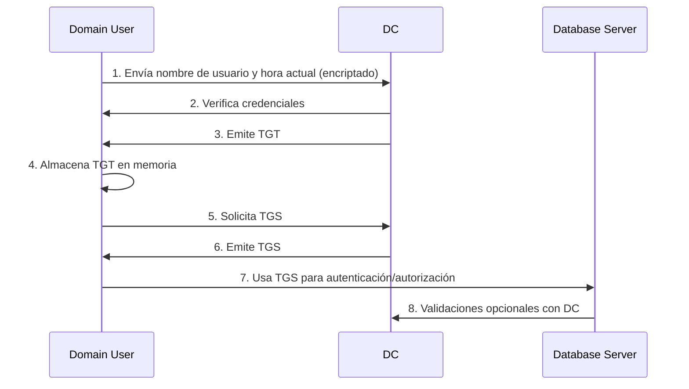
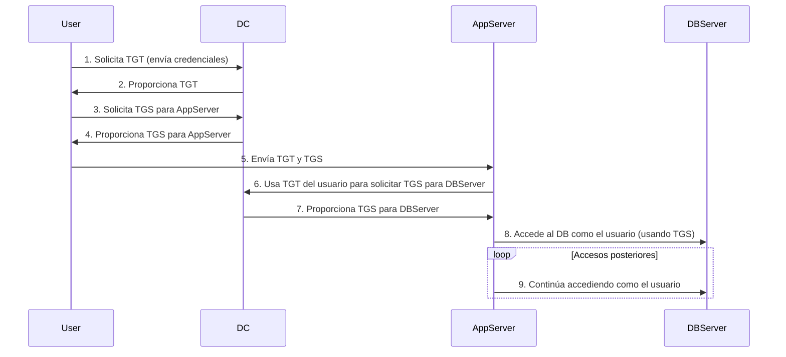

## **Kerberos Authetication Process**

- Ticket Granting Ticket (TGT): Boleto utilizado específicamente para autenticación.
- Ticket Granting Service (TGS): Boleto utilizado específicamente para autorización.

## **Kerberos Delegation Process**

- User (Usuario) → El cliente que solicita acceso a un recurso.
- DC (Domain Controller) → Servidor que autentica y emite tickets (TGT/TGS).
- AppServer (Servidor de Aplicaciones) → Servicio que recibe el TGS y delega acceso.
- DBServer (Servidor de BD) → Recurso final accedido en nombre del usuario.

### **Types of Kerberos Delegation**

1. **Delegación Sin Restricciones (Unconstrained Delegation)**
   - Permite que el Servidor de Aplicaciones use las credenciales del usuario para acceder a cualquier servicio en cualquier servidor del dominio.
   - Está habilitada por defecto en los Controladores de Dominio.
   - Puede representar un riesgo de seguridad si el servidor es comprometido, ya que permite movimiento lateral sin restricciones.
   - Ejemplo: Un servidor de aplicaciones que, al autenticar a un usuario, puede acceder libremente a servicios de base de datos, archivos y otros en toda la red usando las credenciales delegadas del usuario.

2. **Delegación Restringida (Constrained Delegation)**
   - Permite que el Servidor de Aplicaciones use las credenciales del usuario solo para acceder a servicios específicos en servidores específicos.
   - Limita el alcance de la delegación, mejorando la seguridad al restringir qué servicios pueden ser accedidos.
   - Requiere configuración explícita para definir los servicios permitidos.
   - Ejemplo: Un servidor de aplicaciones configurado para usar las credenciales del usuario solo para acceder a un servidor de base de datos particular, evitando acceso a otros servicios del dominio.

