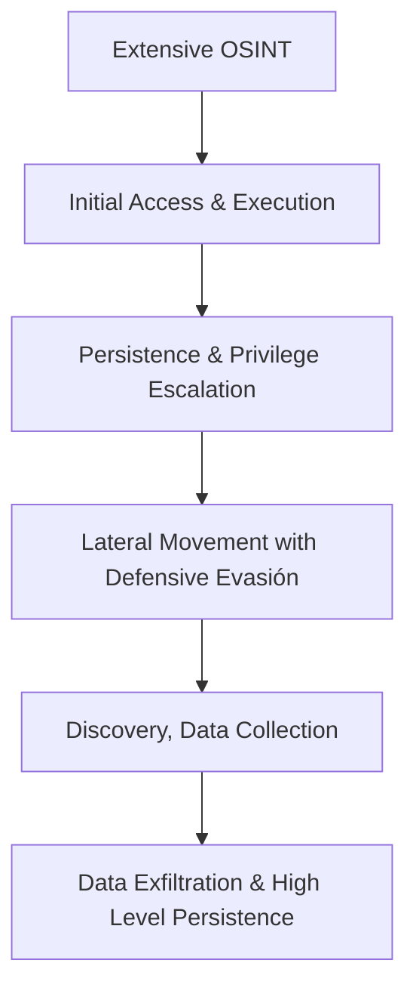

# Ciclo de Vida del Ataque de un Red Team

1. **Extensive OSINT**  
   - En esta etapa se concentra en recolectar cada vez más información pública y accesible sobre la organización objetivo.  
   - Se priorizan las redes sociales y plataformas donde los empleados suelen estar activos para identificar datos útiles que puedan facilitar futuros ataques.  
   - Por ejemplo, un atacante puede descubrir correos electrónicos, roles de empleados o detalles de proyectos a través de LinkedIn o Twitter que luego usará para ataques de ingeniería social.  

2. **Initial Access & Execution**  
   - El objetivo es ingresar al entorno interno utilizando diferentes vectores de entrada, como la explotación de servicios remotos externos o configuraciones incorrectas en aplicaciones web.  
   - Una vez que logra acceso, ejecuta código controlado para tomar control del sistema y comenzar la exploración interna.  
   - Por ejemplo, explotar una vulnerabilidad en un servicio remoto para abrir una sesión de comandos y realizar reconocimiento de red.  

3. **Persistence & Privilege Escalation**  
   - Los atacantes buscan métodos para mantener el acceso pese a reinicios, cambios de contraseña o actualizaciones que podrían bloquear su ingreso.  
   - Pueden crear puertas traseras o modificar cuentas de usuarios con bajos privilegios para usarlas como acceso oculto.  
   - También intentan obtener permisos elevados, aprovechando vulnerabilidades o configuraciones incorrectas para ganar control total del sistema.  
   - Por ejemplo, restablecer la contraseña de un usuario con pocos privilegios y luego escalar a administrador local.  

4. **Lateral Movement**  
   - Una vez dentro, el atacante se desplaza desde el sistema comprometido a otros dispositivos dentro de la misma red para expandir su control.  
   - Puede utilizar herramientas propias o credenciales legítimas junto con herramientas nativas del sistema para evitar ser detectado.  
   - Por ejemplo, usar credenciales válidas para acceder por RDP o SSH a otros servidores y continuar su avance lateral.  

5. **Defensive Evasión**  
   - El atacante implementa técnicas para evitar ser detectado, como ocultar scripts maliciosos, disfrazarse dentro de procesos confiables o deshabilitar software de seguridad.  
   - Esta fase se basa en conocer el entorno para identificar qué defensas evitar o desactivar.  
   - Por ejemplo, desactivar el firewall o el antivirus para que las acciones maliciosas pasen desapercibidas.  

6. **Discovery**  
   - El adversario realiza un reconocimiento interno para entender la arquitectura de la red, los sistemas críticos y los recursos disponibles.  
   - Esto le ayuda a planificar sus próximos movimientos y ataques con mayor efectividad.  
   - Por ejemplo, enumerar archivos y directorios en servidores o recursos compartidos para encontrar información valiosa.  

7. **Data Collection**  
   - En esta etapa se recopila la información sensible encontrada dentro de los sistemas o la red.  
   - Pueden incluir documentos confidenciales, datos copiados en el portapapeles o cualquier otro dato relevante.  
   - Los datos suelen comprimirse o cifrarse para facilitar su manejo.  
   - Por ejemplo, un atacante puede recopilar datos financieros y cifrarlos antes de prepararlos para la extracción.  

8. **Data Exfiltration**  
   - Finalmente, el atacante extrae la información recolectada fuera del entorno comprometido.  
   - Puede usar métodos automáticos para enviar los datos a servidores remotos o medios físicos como memorias USB.  
   - Por ejemplo, programar la transferencia automática de documentos sensibles a un servidor externo o copiar archivos a un dispositivo físico para su extracción.  

